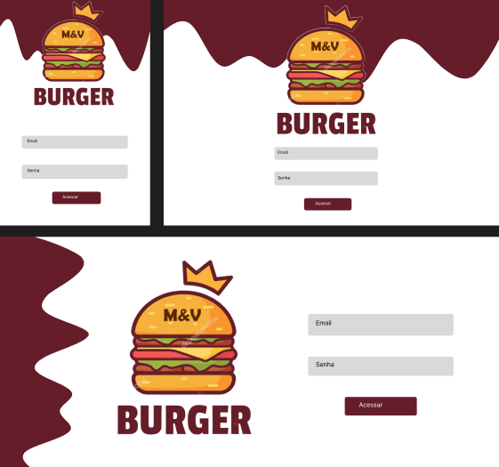
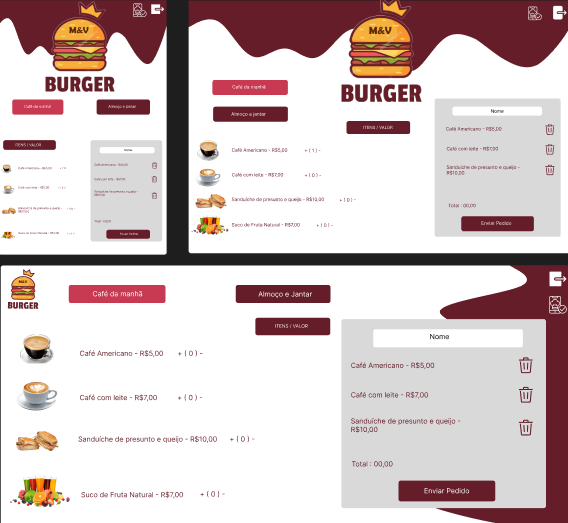
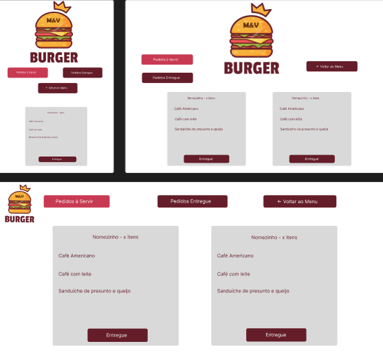
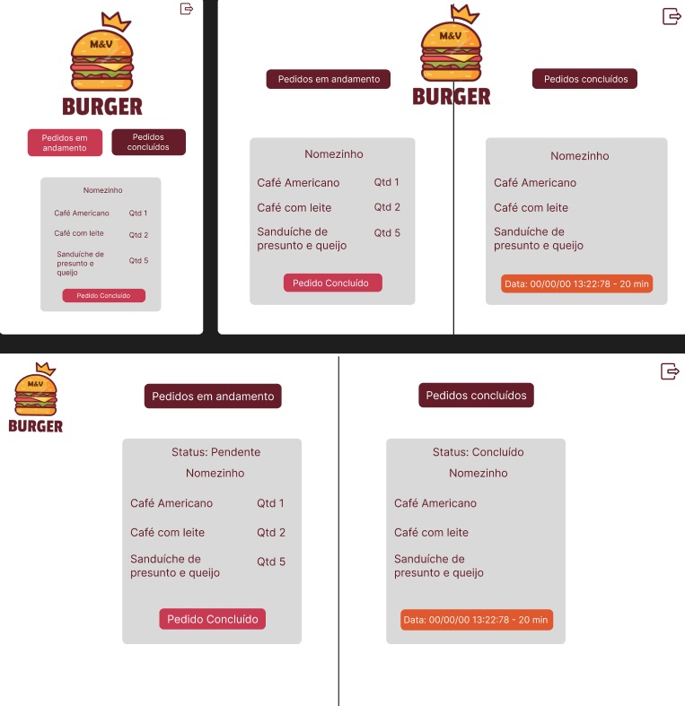
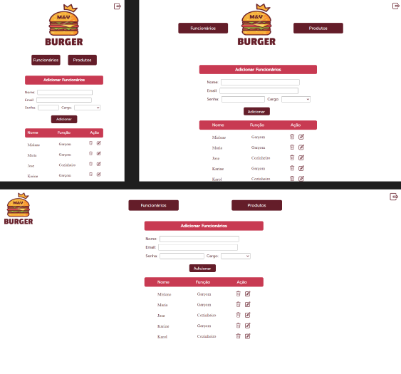
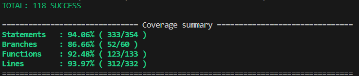

# Burguer MV

Desenvolvido por:

  Mislene Moura 
  <a href="https://www.linkedin.com/in/mislenemoura/">Linkedin</a> | <a href="https://github.com/MisleneSM">Github</a>
   
  Vitória Cabral   
  <a href="https://www.linkedin.com/in/vitoria-cabral-oliveira/">Linkedin</a> | <a href="https://github.com/vitcbrl">Github</a>
   

# Índice

* [1. Resumo do projeto](#1-resumo-do-projeto)
* [2. Histórias de usuário](#2-histórias-de-usuario)
* [3. Protótipo](#3-protótipo)
* [4. Testes unitários](#4-testes-unitários)
* [5. Tecnologias Utilizadas](#5-tecnologias-utilizadas)

## 1. Resumo do Projeto📓

Um pequeno restaurante de hambúrgueres, que está crescendo, necessita de uma interface em que se possa realizar pedidos utilizando um tablet, e enviá-los para a cozinha para que sejam preparados de forma ordenada e eficiente. Neste projeto foi desenvolvido um sistema de pedidos onde o mesmo possui dois tipos de cardápios (Café da Manhã e Almoço e jantar). Nele foi realizado e implementado 3 tipos de acesso de acordo com a sua função, sendo eles o garçom, cozinheiro e administrador. O garçom deve ser capaz de acessar com sua credencial, anotar os pedidos dos clientes e enviá-los para a cozinha. O cozinheiro deve se autenticar no sistema e ter acesso aos pedidos pendentes e concluídos, finalizando com o administrador que deve ser capaz de acessar o sistema e ter acesso ao cadastro, edição e exclusão dos produtos e funcionários da hamburgueria.

## 2. Histórias de usuário🔍

* <strong>História de usuário 1:</strong> Garçom/Garçonete deve poder entrar no sistema, caso o admin já lhe tenha dado as credenciais. Eu, como garçom/garçonete quero entrar no sistema de pedidos.

* <strong>História de usuário 2:</strong> Garçom/Garçonete deve ser capaz de anotar o pedido do cliente. Eu como garçom/garçonete quero poder anotar o pedido de um cliente para não depender da minha memória, saber quanto cobrar e poder enviar os pedidos para a cozinha para serem preparados em ordem.

* <strong>História de usuário 3:</strong> Chefe de cozinha deve ver os pedidos. Eu como chefe de cozinha quero ver os pedidos dos clientes em ordem, poder marcar que estão prontos e poder notificar os garçons/garçonetes que o pedido está pronto para ser entregue ao cliente.

* <strong>História de usuário 4:</strong> Garçom/Garçonete deve ver os pedidos prontos para servir. Eu como garçom/garçonete quero ver os pedidos que estão prontos para entregá-los rapidamente aos clientes.

* <strong>História de usuário 5:</strong> Administrador(a) de loja deve administrar seus funcionários. Eu como administrador(a) de loja quero gerenciar os usuários da plataforma para manter atualizado as informações de meus funcionários.

* <strong>História de usuário 6:</strong> Administrador(a) de loja deve administrar os produtos. Eu como administrador(a) de loja quero gerenciar os produtos para manter atualizado o menu.

## 3. Protótipo🖊️

### Versão Mobile - Tablet - Desktop

#### Telas de Login

#### Telas Garçom - Pedidos e Pedidos à entregar

#### Telas Cozinheiro

#### Telas Administrador

## 4. Testes unitários✅

Desenvolvemos testes unitários abrangendo as funcionalidades e garantindo mais segurança na usabilidade do sistema.

## 5. Tecnologias utilizadas✅  

   
  
  
  
  
  
  
   

 

 

